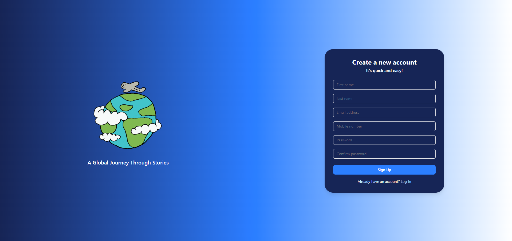
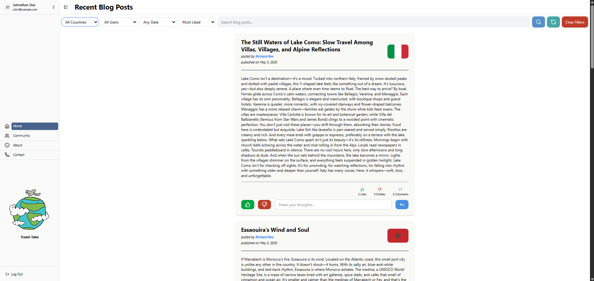

<div align="center">
  <h2="center">Travel Tale</h2>
</div>




### This project is a tourism blog web application developed for the Server-Side Web Development module (Coursework 02). It allows users to share travel stories enriched with real-time country data including flags, currencies, and capital cities. The app uses a REST API built with Node.js and stores data securely in a SQLite database, with client-side interactions handled via Axios.

### Key features include user registration, login, and secure password hashing. Authenticated users can create, edit, and delete their own blog posts, follow other users, and interact through likes, dislikes, and comments. Posts are publicly viewable and searchable by country or author, with results displayed in a paginated format.

### The application follows a modular and secure architecture, with MVC structure and clear separation of concerns. It includes a dropdown of all countries with dynamic metadata display and offers optional Docker containerization for deployment. The platform combines storytelling with verified data to build a trusted travel community.

### Built with

- [![React][React.js]][React-url]
- [![Vite][Vite.js]][Vite-url]
- [![TailwindCss][TailwindCss]][Tailwind-url]
- [![Node][Node.js]][Node-url]
- [![Express][Express.js]][Express.js-url]
- [![Sequelize][Sequelize]][Sequelize-url]
- [![SQLite][SQLite]][SQLite-url]
- [![Docker][Docker]][Docker-url]
- [![Swagger][Swagger]][Swagger-url]

## Getting started

### Prerequisites

- node.js: [Node.js download page](https://nodejs.org/en/download)
- React.js: [React official website](https://reactjs.org/)
- Vite: [Vite start guide](https://vite.dev/guide/)
- Tailwind CSS: [Tailwind getting stared](https://tailwindcss.com/docs/installation/using-vite)
- SQLite: [SQLite download page](https://www.sqlite.org/download.html)
- Docker: [Docker download page](https://www.docker.com/products/docker-desktop/)

### Installation

1. Clone the repo
   ```bash
   git clone https://github.com/CharakaJith/coursework_02_20200241_w1810001.git
   ```
2. Step into the project
   ```bash
   cd coursework_02_20200241_w1810001
   ```

### Start the project using Docker (recommended)

1. Build the docker image
   ```bash
   docker-compose build
   ```
2. Run the container using image
   ```bash
   docker-compose up
   ```
3. Stop running container
   ```bash
   docker-compose down
   ```

### Start the project using terminal

1. Install NPM packages
   ```bash
   npm run install:all
   ```
2. Create database tables
   ```bash
   npm run migrate:up
   ```
3. Start the server and client
   ```bash
   npm run start
   ```

### Other scripts

1. Start the development server
   ```bash
   npm run dev
   ```
2. Start the client
   ```bash
   npm run client
   ```
3. Undo the most recent database migration
   ```bash
   npm run migrate:down
   ```
4. Undo all database migrations
   ```bash
   npm run migrate:down:all
   ```

## Assumptions

The following assumptions were made during the development of this project:

### 1. Environment Configuration

- The application runs in a Node.js environment (version 20.18.1).
- Environment variables are provided in a `.env` file.
- The app uses `NODE_ENV=development` or `NODE_ENV=production`.

### 2. Database

- **SQLite** is used for local development and testing.
- The database schema is designed in **Third Normal Form (3NF)** to reduce redundancy and ensure data integrity.
- **Sequelize** is used as the ORM for interacting with the SQLite database.
  - **Sequelize** provides a straightforward API for working with relational databases and allows for easy migrations and model definition.
  - It abstracts the complexity of SQL queries, making it easier to manage data and perform CRUD operations.
  - Sequelize supports multiple dialects (including SQLite, PostgreSQL, MySQL), providing flexibility for future changes to the database engine.
  - It also supports relationships between tables (one-to-many, many-to-many), making it suitable for complex data models.
- A `user` table is used to store user credentials and related information.
- The `follow` table is used to track the following relationships between users.
- The `post` table is used to store blog posts published by users, while the `comment` and `like` tables track the comments, likes, and dislikes associated with each post.
- `country` and `currency` tables are used to store and manage session-related data where applicable.
- The database schema remains consistent across environments unless explicitly modified.

### 3. Authentication & Security

- Passwords are hashed securely (e.g., using bcrypt) before being stored in the database.
- User authentication is handled using **JSON Web Tokens (JWT)**, which are issued upon successful login and validated on protected routes.
- Users cannot delete or update posts that do not belong to them, but they can react to or comment on them. Conversely, a user cannot like or comment on their own post - they can only edit or delete it.

### 4. External APIs

- The RestCountries API is assumed to be available and stable.
- The structure of the API response is expected to remain consistent.

### 5. User Roles & Access

- Only authenticated users can access protected endpoints.
- No admin or multi-tier access roles are implemented unless explicitly stated.

### 6. Request & Response Handling

- Client requests are expected to be well-formed and follow the defined API contract.
- Errors are handled using appropriate HTTP status codes and clear response messages.

### 8. Logging

- The application uses **Winston** for logging, with log files rotating daily.
- Logs include details about HTTP requests, response status, and error messages.
- The log format includes timestamps, log levels, and structured JSON data.
- Error stack traces are logged only in development mode.
- Sensitive information is not logged.
- Logs are kept for **14 days** before being automatically deleted.

### 9. Error Handling

- The application uses a custom error handler to manage errors and send appropriate responses.
- Errors are logged using **Winston** with the log type depending on the error severity (`ERROR`, `FAIL`).
- The error handler responds with an appropriate HTTP status code and error message.
- In development mode, the full stack trace is included in the response for debugging purposes.
- Sensitive error details (like passwords or tokens) are not included in the logs or responses.

### 10. Architecture

- The application follows a layered architecture with the following structure:

  - **Client**: The front-end or external application that interacts with the API.
  - **Route**: Defines the HTTP routes and endpoints exposed to the client.
  - **Controller**: Handles incoming requests and delegates business logic to services.
  - **Service**: Contains the core business logic and operations.
  - **DAO (Data Access Object)**: Provides an abstraction layer for interacting with the database.
  - **Database**: The SQLite database is used for storing and managing data.

## Documentations

- [Postman API documentation](https://documenter.getpostman.com/view/28014836/2sB2j7fAYT)
- [System architecture diagram](https://lucid.app/lucidchart/436dfa9f-b542-4e8a-a1df-76894b573fb9/edit?viewport_loc=-1365%2C-95%2C5443%2C2530%2C0_0&invitationId=inv_e845e655-c405-4c44-b7f9-8e1d705223a0)
- [Entity relation diagram](https://lucid.app/lucidchart/447f022c-b8cb-487f-86e1-62cb4a9d4d71/edit?viewport_loc=-816%2C-155%2C2992%2C1391%2C0_0&invitationId=inv_512ecbd0-5b5e-4787-946d-fb8d5b860876)

## Contact

Email: [charaka.info@gmail.com](mailto:charaka.info@gmail.com) | LinkedIn: [Charaka Jith Gunasinghe](https://www.linkedin.com/in/charaka-gunasinghe/)

<!-- MARKDOWN LINKS & IMAGES -->

[React.js]: https://img.shields.io/badge/React-20232A?style=for-the-badge&logo=react&logoColor=61DAFB
[React-url]: https://reactjs.org/
[Vite.js]: https://img.shields.io/badge/Vite-646CFF?style=for-the-badge&logo=vite&logoColor=white
[Vite-url]: https://vite.dev
[TailwindCss]: https://img.shields.io/badge/Tailwind_CSS-06B6D4?style=for-the-badge&logo=tailwind-css&logoColor=white
[Tailwind-url]: https://tailwindcss.com/
[Node.js]: https://img.shields.io/badge/Node.js-12A952?style=for-the-badge&logo=node.js&logoColor=white
[Node-url]: https://nodejs.org/en
[Express.js]: https://img.shields.io/badge/Express.js-000000?style=for-the-badge&logo=express&logoColor=white
[Express.js-url]: https://expressjs.com/
[SQLite]: https://img.shields.io/badge/SQLite-003B57?style=for-the-badge&logo=sqlite&logoColor=white
[SQLite-url]: https://sqlite.org/download.html
[Docker]: https://img.shields.io/badge/Docker-2496ED?style=for-the-badge&logo=docker&logoColor=white
[Docker-url]: https://www.docker.com/
[Swagger]: https://img.shields.io/badge/Swagger-85EA2D?style=for-the-badge&logo=swagger&logoColor=black
[Swagger-url]: https://swagger.io/
[Sequelize]: https://img.shields.io/badge/Sequelize-52B0E7?style=for-the-badge&logo=sequelize&logoColor=white
[Sequelize-url]: https://sequelize.org/
